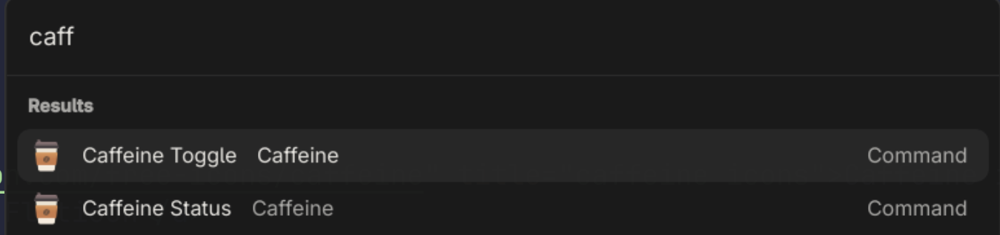

# Caffeine

> A [Vicinae](https://github.com/vicinaehq/vicinae) extension to control [Caffeine Gnome extension](https://github.com/eonpatapon/gnome-shell-extension-caffeine), directly from Vicinae.

## Demo



## Features

- Enable or Disable Caffeine Gnome extension from Vicinae.
- View current Caffeine status.

This extension uses `gsettings` command line tool under the hood to interact with Gnome's notification settings.

## Getting Started

## Pre Requisites

- This extension requires the [Caffeine Gnome extension](https://github.com/eonpatapon/gnome-shell-extension-caffeine) to be installed and enabled in your Gnome desktop environment.

### Installation

- Use the Vicinae extension store to find and install the "Gnome Caffeine" extension.
- Alternatively, clone this repository and follow the development instructions below.

## Development

```bash
npm install
```

To run the extension in development mode, use:

```bash
npm run dev
```

To build the extension for production, use:

```bash
npm run build
```

## Acknowledgements

<a href="https://www.flaticon.com/free-icons/caffeine" title="caffeine icons">Caffeine icons created by AmethystDesign - Flaticon</a>

## License

This project is licensed under the MIT License. See the [LICENSE](./LICENSE) file for details.